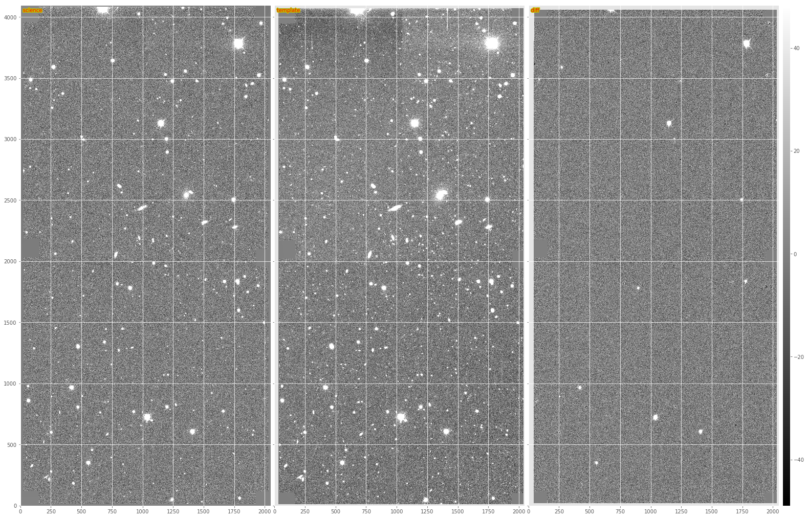
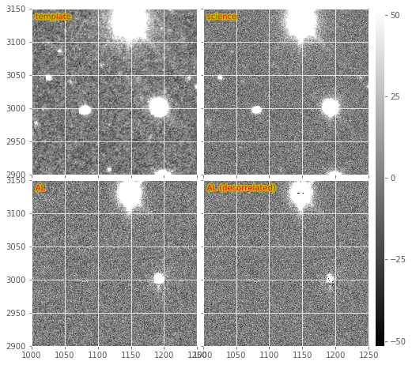
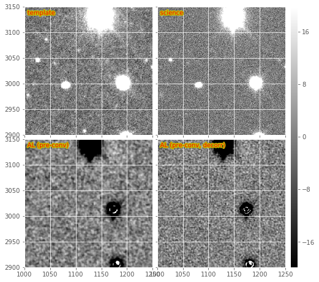
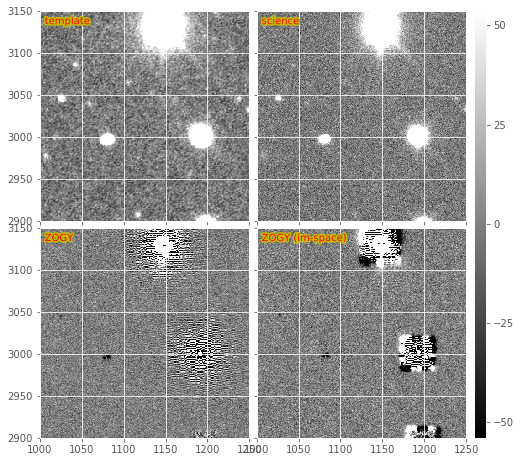
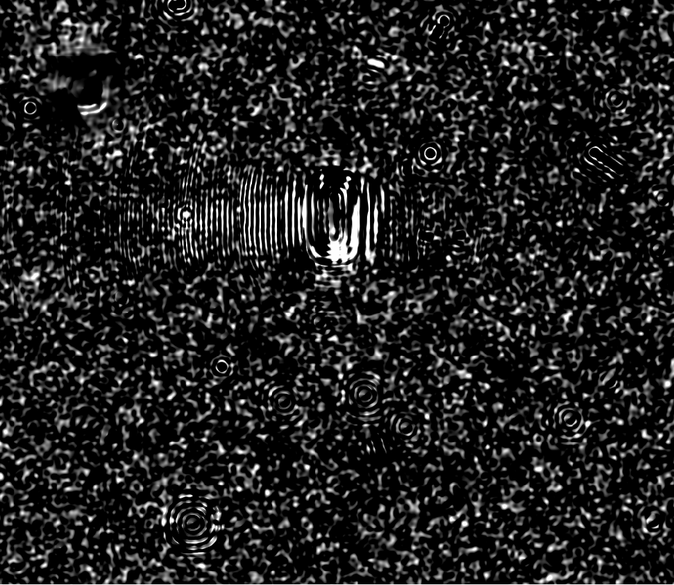
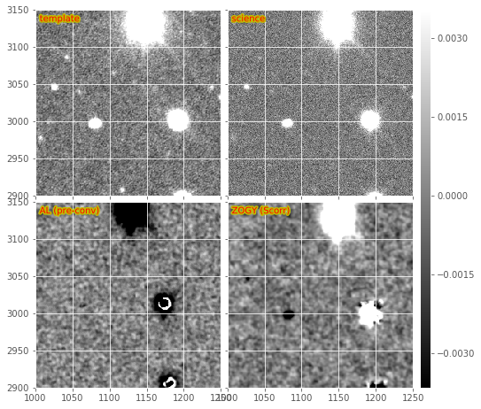
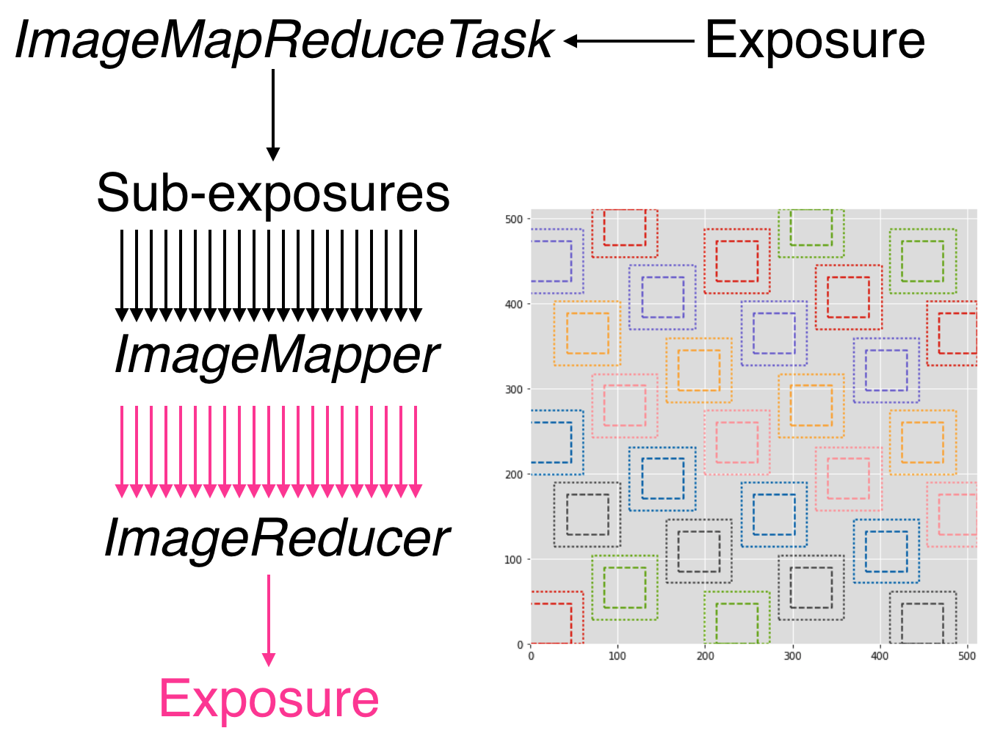

:tocdepth: 2
The AL algorithm is used by default in ``ip_diffim`` to perform PSF
matching and image subtraction. It performs quickly and well because it
uses small regions surrounding bright, isolated stars around to compute
the PSF-matching kernel, :math:`k_i`, at various locations :math:`i`
across the image. It uses various heuristics to pre-filter those bright
stars prior to computation of the :math:`k_i`, and once they are
computed, uses PCA to estimate a smoothly spatially-varying :math:`k`
from them.

There are a very large number of configuration parameters which affect
the quality of the subtraction. In general, the defaults work well,
although for images with different pixel-scales and/or PSF sizes, these
parameters may need to be tuned. Many of these important parameters are
buried deep in the ``kernel`` config parameter of the ``subtract``
algorithm (a reference to the ``lsst.ip.diffim.ImagePsfMatchTask``
task).

The image subtraction script is in ``lsst.pipe.tasks.imageDifference``,
which performs image subtraction and then detects and measures sources
(``diaSources``) in the subtractions. This task itself very recently was
refactored (DM-3704) and split into two separate tasks which now reside
in ``ip_diffim``: ``MakeDiffimTask`` and ``ProcessDiffimTask``, which
are called sequentially from the command-line ``imageDifference.py``.

In `Figure 1 <#figure-1>`__ and `Figure 2 <#figure-2>`__, we show an
image subtraction using the AL algorithm on an example DECam image. Here
we use a single ``calexp`` as the template to highlight the effects of
noise in the template and how these are mitigated. Note that the
subtraction is decorrelated (see Section 1.2.), as this is now the
default when image subtraction is run via the LSST stack.

   From left to right, sample science image, warped and PSF-matched
   template, and AL difference image.

**Timing:** The baseline benchmark for performing basic AL on the
example DECam exposure (on my 2015 Macbook 15 with a 2.5 GHz Intel Core
i7 is 31.8 seconds. This includes registration and selection of
PSF-matching stars, as well as generation of output image files, but
*excludes* any diaSource detection or measurement.

1.1. Pre-convolution
====================

An un-published modification to the AL algorithm was implemented, which
accounts for the occasions when the width of the PSF of the science
image is :math:`\leq` the width of the PSF of the template image. In
this case, AL cannot convolve the template to match that of the science
image; it instead would need to deconvolve the template, which would
result in ringing artifacts. Instead, the science image is
"pre-convolved," or "pre-filtered" with its own PSF, or a Gaussian
approximation of it. If the template PSF is narrower than
:math:`\sqrt{2}\times` that of the science image, then AL will now work,
but the resulting image subtraction will have been pre-filtered by the
science image's PSF. This image then corresponds to the match-filtered
"likelihood" image subtraction, which has already been convolved with
its own PSF, and thus for detection, just needs to be thresholded. A
special case is then needed to do any kind of measurement on detected
sources in this image. I am not entirely sure how that works.

**Timing:** Image subtraction with pre-convolution extends the run-time
of basic AL from the aforementioned 31.8 seconds to 55.6 seconds, an
increase in run-time of :math:`\sim 75\%`. This is likely due to the
need to increase the dimensions of the convolution kernels and stamps
upon which PSF matching is performed to ensure that the larger PSF of
the pre-convolved science exposure is fully included.

1.2. AL Decorrelation
=====================

When the template exposure has significant noise (i.e., is not
constructed from a number of coadds), then AL will correlate the noise
among neighboring pixels when it convolves the template with the
PSF-matching kernel, :math:`k`. As a result, the noise will be
correlated in the image subtraction, leading to inaccurate detection and
measurement (see `DMTN-006 <https://dmtn-021.lsst.io/>`__ for details).
In `DMTN-021 <https://dmtn-021.lsst.io/>`__, we describe a method for
"decorrelating" the AL image subtraction, and this has been implemented
in the LSST image subtraction code, in the module
``lsst.ip.diffim.imageDecorrelation``. Decorrelation is toggled via the
``doDecorrelation`` config option, which is enabled by default. Below in
`Figure 2 <#figure-2>`__ we show a subsection of the images from `Figure
1 <#figure-1>`__, including both the regular (non-decorrelated) and the
default (decorrelated) AL subtractions on the bottom.

   Subsections of a DECam image subtraction, including warped and
   PSF-matched template, science image, and both decorrelated and
   non-decorrelated AL difference images.

There occasionally is a problem with decorrelation that I have not been
able to narrow down, other than that I believe it is related to the
shape/structure of the PSF matching kernel. Note that if the term in the
denominator of the expression for :math:`\psi(k)` is too close to zero,
it will lead to large values in the kernel, which could lead to strange
aliasing artifacts in the resulting decorrelated diffim.

See section (1.2.1) below for details and complications of implementing
decorrelation in the case of pre-convolution (section 1.1), and see
section (3) below for details about how the decorrelation is performed,
when accounting for spatially-varying PSFs and noise.

**Timing:** Enabling decorrelation increases the run-time of the AL
algorithm on a sample DECam exposure by :math:`\sim 1.7` second, or
about 5.4%.

1.2.1. Decorrelation + pre-convolution = trouble
------------------------------------------------

The variant of the expression for performing decorrelation in the case
of pre-convolution (described above) is given by the deconvolution
kernel, :math:`\psi(k)` as described in `Equation 3 in
DMTN-021 <https://dmtn-021.lsst.io/#equation-equation-3>`__. The
expression includes the pre-filter kernel, :math:`M(k)` described above.

This modified decorrelation kernel has been implemented in
``ip_diffim``, and is used automatically in ``imageDifference.py`` when
both the ``doDecorrelation`` and the ``doPreConvolution`` config options
are enabled. In `Figure 3 <#figure-3>`__, we show the same DECam image
subsection as in `Figure 2 <#figure-2>`__, but in which the template and
science image were swapped and pre-convolution is turned on. The bottom
two sub-images show the resulting match-filtered subtractions, with and
without decorrelation enabled. In many cases the decorrelation kernel is
unstable due to the inclusion of the PSF in the denominator. This leads
to strange aliasing-type artifacts in the resulting decorrelated
likelihood image subtraction, which are extremely large and globally
affect the pixel statistics of the decorrelated, pre-filtered image
subtraction (i.e., give them very large variances). This effect has been
decreased by setting all pixels that are :math:`\leq 10^{03}` to
:math:`10^{-3}` in the PSF prior to FFT-ing, but the effect still
remains. Artifacts around bright stars/poorly-subtracted objects are
amplified, and will be difficult to model (visible in `Figure
3 <#figure-3>`__). This could be mitigated somewhat by better pixel
flagging.

   Subsections of a pre-convolved DECam image subtraction, including
   warped and PSF-matched template, science image, and both decorrelated
   and non-decorrelated mmatch-filtered AL difference images.

It should also be noted that currently the spatially-varying
decorrelation (described below) is functional in the case when
pre-convolution is also enabled. These images show the same issues as
the non-spatially-varying version described above.

**Timing:** Enabling decorrelation along with pre-convolution increases
run-time from 55.6 to 68.0 seconds, or an increase of 22.3%. It is not
clear why decorrelation in the case of pre-convolution increases
run-time so significantly when it does not do so when pre-convolution is
disabled.

2. Zackay, et al. (2016) (ZOGY) image subtraction
=================================================

The Zogy algorithm is implemented in the LSST stack, and is enabled by
setting the config ``makeDiffim.subtract='zogy'``. The main guts of the
algorithm and its task are in the ``lsst.ip.diffim.zogy`` submodule. It
is functional. It is implemented in pure python; although much of the
expensive calculations are performed under-the-hood in ``C`` or
``Fortran`` via ``scipy`` or ``afw``, be they FFTs or convolutions.

We show an example Zogy diffim below in `Figure 4 <#figure-4>`__. The
standard Zogy implementation, in which all convolutions are performed in
frequency space, is on the bottom-left. It shows clear signs of aliasing
and fringing-related artifacts around bright stars. It also shows (with
the negative artifacts near fainter stars) the effect of the apparent
inaccurate relative flux calibration between the template and science
images. (Note that no attempt to improve the relative calibration is
performed in the Zogy code -- it is expected to be accurately performed
during initial exposure calibration. This reveals a weakness of Zogy
relative to AL -- the requirement of accurate [relative] calibration
between the two images.) This may be seen more readily in an other
subimage from the same DECam image (`Figure 5 <#figure-5>`__).

   Subsections of a DECam Zogy image subtraction, including warped and
   PSF-matched template, science image, and the results of the
   "standard" and image-space versions of the Zogy algorithm.

   Subsections of the same DECam Zogy image subtraction as in Figure 4.

**Timing:** The current implementation of Zogy takes roughly 26.6
seconds, or :math:`0.78\times` as long (i.e., is :math:`\sim22\%`
faster) to run than the AL algorithm with decorrelation enabled. There
has been limited attempt to date to optimize the Zogy algorithm, and
some simple profiling is likely to highlight several bottlenecks.

2.1. Variants (image-space convolutions)
----------------------------------------

The convolutions in Zogy may be performed in image (real)-space rather
than in frequency space. This is beneficial in the LSST stack as then
the convolutions may be performed using the ``afw`` framework, which
accounts for masks and propagates the convolutions through to the
variance and mask planes of the exposures. The image-space convolution
Zogy images are shown in the bottom-right of `Figure 4 <#figure-4>`__
and `Figure 5 <#figure-5>`__. Because the convolution kernel is
spatially constrained, we see that the artifacts evident in the
"standard" Zogy implementation (bottom left of those figures) are also
spatially constrained. However, it is also evident that echo-like
artifacts are also generated in the image-space version which can be
severe surrounding the brightest stars. These artifacts lead to a
greater number of false positive detections (472 vs. 257 before merging;
227 vs. 221 after).

Efforts were made to ensure that masks and variance planes are correctly
handled in the "pure" Fourier-space version of the algorithm, such that
the concerns about using ``afw`` for convolutions and handling
masks/variance correctly should be less of a concern.

**Timing:** The run-time of the image-space version of Zogy is
:math:`\sim55.4` seconds, or nearly :math:`2.1\times` as long as the
"pure" Fourier-space version.

2.3. The ZOGY :math:`S_{corr}` image
------------------------------------

The Zogy manuscript describes the derivation of the "likelihood" image,
which they call :math:`S_{corr}`, because it may be *corrected* for
various terms such as astrometric errors/scintillation. This image is
analogous to the pre-convolved, decorrelated AL diffim in that it is
already pre-match-filtered with its own PSF, and thus may simply be
thresholded for detection. The Zogy code in ``ip_diffim`` has the option
of computing this image. Because of its similarity to the
pre-convolution option in AL, it is enabled in the
``imageDifference.py`` command-line script by setting the config option
``makeDiffim.doPreConvolve`` to ``True``. We show an example
:math:`S_{corr}` image in the bottom-right of `Figure 6 <#figure-6>`__,
which may be compared with the AL version (non-decorrelated) on the
bottom-left of `Figure 6 <#figure-6>`__ and both decorrelated and
non-decorrelated versions of AL at the bottom of `Figure
3 <#figure-3>`__. The :math:`S_{corr}` image again shows (what I believe
to be) the effect of inaccurate relative calibration between the two
input images.

   Subsections of a DECam Zogy image subtraction, including warped and
   PSF-matched template, science image, and the results of pre-convolved
   AL subtraction, and the Zogy :math:`S_corr` likelihood image.

2.4. Issues, unimplemented aspects, artifacts
---------------------------------------------

3. Spatial variations via ``ImageMapReduce``
============================================

The calculations underlying both AL decorrelation and Zogy depend upon
factors with vary spatially across both input images, such as
PSF-matching kernel (AL) PSFs of both images (Zogy), and noise in both
images (AL and Zogy). Both algorithms also involve computing FFTs of
kernels or images, which cannot intrinsically include the spatially
varying components. Therefore, to capture these spatial variations, I
developed a flexible framework which "chops" the images into sub-images,
performs a given algorithm on those sub-images, and then "re-stitches"
the resulting modified sub-images back into a single exposure. This has
an analogy with the ``map-reduce`` algorithm, so it is called the
``imageMapReduce`` framework, implemented in the submodule
``lsst.ip.diffim.imageMapReduce``.

3.1. imageMapReduce: Implementation details
-------------------------------------------

The ``imageMapReduce`` framework may be visualized via the following
schematic (`Figure 7 <#figure-7>`__). The ``ImageMapReduceTask`` chops
up the input ``Exposure`` into subExposures, which are then processed by
the ``ImageMapper``. The modified subExposures are stitched back
together by the ``ImageReducer`` into a new ``Exposure``.

   Schematic of the ``imageMapReduce`` framework for performing
   spatially-varying calculations on one or more exposures. The inset
   shows an example grid. Only every fifth grid element is drawn, for
   clarity.

The ``ImageMapReduceTask`` accepts a set of configuration parameters
that specify how the grid is constructed (grid element size and
spacings). The grid specification is flexible so that it may containg
arbitrary overlapping regions between grid elements, and be of arbitrary
dimensions. The dimensions may also be specified in units of the FWHM of
the PSF of the input ``Exposure``. An important detail is that one may
also specify an "expanded border" region for each grid element. If this
is done, then two subExposures are passed to the ``mapper`` subtask (see
below). An example grid is shown in the inset of `Figure
7 <#figure-7>`__, including the "expanded" sub-regions in the dotted
lines.

The ``ImageMapReduceTask`` also accepts configuration parameters that
specify the ``mapper`` and ``reducer`` subtasks. The
``ImageMapReduceTask`` then chops up the input ``Exposure`` and passes
those subExposures independently to the ``run`` method of its ``mapper``
subtask. The ``mapper`` subtask is a subclass of ``ImageMapper``, and
its ``run`` method performs the calculations on the subExposure,
returning a modified subExposure (optionally with a modified PSF), along
with other metadata. (It may optionally return something other than an
exposure, e.g. a float, which can be useful for, for example, computing
statistics or doing other measurements on a grid across the input
Exposure.) If the "expanded border" is specified (as is needed by both
AL decorrelation and Zogy) then two subExposures are passed to the
``mapper``'s ``run`` method. The calculations are to be computed on the
expanded subExposure, and then the sub-image of the expanded subExposure
corresponding to the original grid element size is returned. This allows
operations such as convolutions or FFTs to be performed on the larger
image and the resulting invalid pixels at the borders are cut away
before passing the valid subExposure back to the ``reducer`` (see the
inset of `Figure 7 <#figure-7>`__).

The returned, modified subExposures are then stitched together by the
``reducer`` subtask into a final output ``Exposure``, averaging the
overlapping regions (by default).

In order to perform spatially-varying AL decorrelation or Zogy, one
simply needs to subclass the ``ImageMapper`` task and the
``ImageMapReduceConfig`` configuration class, and configure the
``mapper`` parameter in that new config to point to this new subclass.

3.1.1. imageMapReduce: AL decorrelation
~~~~~~~~~~~~~~~~~~~~~~~~~~~~~~~~~~~~~~~

3.1.2. imageMapReduce: Zogy
~~~~~~~~~~~~~~~~~~~~~~~~~~~

3.2. Known issues
-----------------

4. Dipole fitting complications
===============================

5. Conclusions and recommendations for future work
==================================================

--------------

1. DONE: decorrelation + preconvolution aliasing issues
2. DONE: zogy artifacts
3. FIXED: issue with zogy when psfs have different dimensions (offset
   due to psf padding) --- DONE: this is now fixed but points out issues
   when images are not properly flux-calibrated
4. DONE: additional artifacts when zogy run with image-space
   convolutions
5. imageMapReduce gridding could be optimized, right now makes the
   map-reduce part slow.
6. use of coaddPsf not ideal -- detection is fast but measurement is
   SLOW
7. differences between what is produced by A&L vs. ZOGY (e.g. matched
   template, etc.) and how to handle that with DipoleFitting. Zogy in
   spatially varying mode does not return the matchedTemplate, and thus
   it is not used for dipole fititng.

-  the cross-convolved images in Zogy are not useful for dipole fitting.

8. spatially-varying decorrelation is done by computing the kernel on
   chunks, and then convolving it on those chunks. should consider
   computing on chunks, then creating smoothly spatially-varying kernel,
   then convolving the image w/ the spatially varying kernel
