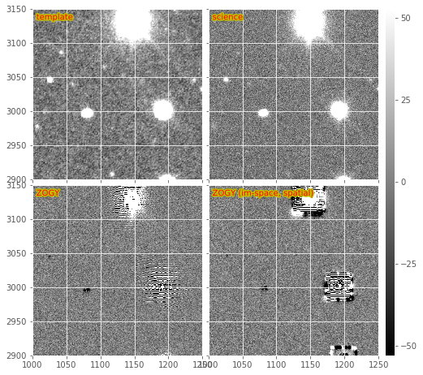

:tocdepth: 2
**Important note:** There exists an un-merged branch ``tickets/DM-3704``
of ``ip_diffim`` and ``pipe_tasks`` which implements tickets
`DM-3704 <https://jira.lsstcorp.org/browse/DM-3704>`__,
`DM-5294 <https://jira.lsstcorp.org/browse/DM-5294>`__ and
`DM-5295 <https://jira.lsstcorp.org/browse/DM-5295>`__, a refactor of
the large and sprawling code in the existing command-line
task\ ``lsst.pipe.tasks.imageDifference.py``. At the time of this
writing, the responsibilities of the existing task were split into two
separate command-line tasks (and their corresponding pipe tasks) and
moved from ``pipe_tasks`` into ``ip_diffim``. These new tasks are in the
submodules ``lsst.ip.diffim.makeDiffim`` and
``lsst.ip.diffim.processDiffim``. Correspondingly,
``imageDifference.py`` is now primarily a wrapper around these two tasks
which call ``MakeDiffimTask.run()`` and ``ProcessDiffimTask.run()`` in
order, taking the same exact input and producing the same exact output
as previously.

The remaining text below will assume that this refactor eventually gets
merged into master, and thus will refer to ``makeDiffim``,
``processDiffim``, etc.

1. Alard and Lupton (AL) PSF matching and image subtraction
===========================================================

The AL algorithm is used by default in ``ip_diffim`` to perform PSF
matching and image subtraction. It performs quickly and well because it
uses small regions surrounding bright, isolated stars around to compute
the PSF-matching kernel, :math:`k_i`, at various locations :math:`i`
across the image. It uses various heuristics to pre-filter those bright
stars prior to computation of the :math:`k_i`, and once they are
computed, uses PCA to estimate a smoothly spatially-varying :math:`k`
from them.

There are a very large number of configuration parameters which affect
the quality of the subtraction. In general, the defaults work well,
although for images with different pixel-scales and/or PSF sizes, these
parameters may need to be tuned. Many of these important parameters are
buried deep in the ``kernel`` config parameter of the
``lsst.ip.diffim.ImagePsfMatchTask`` task (which is the ``subtract``
subtask of ``MakeDiffimTask``).

In `Figure 1 <#figure-1>`__ and `Figure 2 <#figure-2>`__, we show an
image subtraction using the AL algorithm on an example DECam image. Here
we use a single ``calexp`` as the template to highlight the effects of
noise in the template and how these are mitigated. Note that the
subtraction is decorrelated (see Section 1.2.), as this is now the
default when image subtraction is run via the LSST stack.

.. figure:: _static/fig01.png
   :name: figure-1

   From left to right, sample science image, warped and PSF-matched
   template, and AL difference image.

**Timing:** The baseline benchmark for performing basic AL on the
example DECam exposure (on my 2015 Macbook 15 with a 2.5 GHz Intel Core
i7 is 31.8 seconds. This includes registration and selection of
PSF-matching stars, as well as generation of output image files, but
*excludes* any diaSource detection or measurement.

1.1. Pre-convolution
--------------------

An un-published modification to the AL algorithm was implemented, which
accounts for the occasions when the width of the PSF of the science
image is :math:`\leq` the width of the PSF of the template image. In
this case, AL cannot convolve the template to match that of the science
image; it instead would need to deconvolve the template, which would
result in ringing artifacts. Instead, the science image is
"pre-convolved," or "pre-filtered" with its own PSF, or a Gaussian
approximation of it. If the template PSF is narrower than
:math:`\sqrt{2}\times` that of the science image, then AL will now work,
but the resulting image subtraction will have been pre-filtered by the
science image's PSF. This image then corresponds to the match-filtered
"likelihood" image subtraction, which has already been convolved with
its own PSF, and thus for detection, just needs to be thresholded. A
special case is then needed to do any kind of measurement on detected
sources in this image. I am not entirely sure how that works.

**Timing:** Image subtraction with pre-convolution extends the run-time
of basic AL from the aforementioned 31.8 seconds to 55.6 seconds, an
increase in run-time of :math:`\sim 75\%`. This is likely due to the
need to increase the dimensions of the convolution kernels and stamps
upon which PSF matching is performed to ensure that the larger PSF of
the pre-convolved science exposure is fully included. Plus the extra
convolution, which takes :math:`\sim 10` seconds on my machine on the
single DECam CCD exposure.

1.2. AL Decorrelation
---------------------

When the template exposure has significant noise (i.e., is not
constructed from a number of coadds), then AL will correlate the noise
among neighboring pixels when it convolves the template with the
PSF-matching kernel, :math:`k`. As a result, the noise will be
correlated in the image subtraction, leading to inaccurate detection and
measurement (see `DMTN-006 <https://dmtn-021.lsst.io/>`__ for details).
In `DMTN-021 <https://dmtn-021.lsst.io/>`__, we describe a method for
"decorrelating" the AL image subtraction, and this has been implemented
in the LSST image subtraction code, in the module
``lsst.ip.diffim.imageDecorrelation``. Decorrelation is toggled via the
``doDecorrelation`` config option, which is enabled by default. Below in
`Figure 2 <#figure-2>`__ we show a subsection of the images from `Figure
1 <#figure-1>`__, including both the regular (non-decorrelated) and the
default (decorrelated) AL subtractions on the bottom.

.. figure:: _static/fig02.png
   :name: figure-2

   Subsections of a DECam image subtraction, including warped and
   PSF-matched template, science image, and both decorrelated and
   non-decorrelated AL difference images.

There occasionally is a problem with decorrelation that I have not been
able to narrow down. This problem manifests as noise with a periodic
pattern, apparently an overestimated noise problem with some aliasing.
This issue is rather rare and I have seen it particularly on notably
noisy or poorly reduced images. I believe it is related to the
shape/structure of the PSF matching kernel. If the term in the
denominator of the expression for :math:`\psi(k)` is too close to zero,
it will lead to large values in the kernel, which could lead to strange
aliasing artifacts in the resulting decorrelated diffim.

See section (1.2.1) below for details and complications of implementing
decorrelation in the case of pre-convolution (section 1.1), and see
section (3) below for details about how the decorrelation is performed,
when accounting for spatially-varying PSFs and noise.

**Timing:** Enabling decorrelation increases the run-time of the AL
algorithm on a sample DECam exposure by :math:`\sim 10.5` seconds, or
about 33%.

1.2.1. Decorrelation + pre-convolution
~~~~~~~~~~~~~~~~~~~~~~~~~~~~~~~~~~~~~~

The variant of the expression for performing decorrelation in the case
of pre-convolution (described above) is given by the deconvolution
kernel, :math:`\psi(k)` as described in `Equation 3 in
DMTN-021 <https://dmtn-021.lsst.io/#equation-equation-3>`__. The
expression includes the pre-filter kernel, :math:`M(k)` described above.

This modified decorrelation kernel has been implemented in
``ip_diffim``, and is used automatically in ``imageDifference.py`` when
both the ``doDecorrelation`` and the ``doPreConvolution`` config options
are enabled. In `Figure 3 <#figure-3>`__, we show the same DECam image
subsection as in `Figure 2 <#figure-2>`__, but in which the template and
science image were swapped and pre-convolution is turned on. The bottom
two sub-images show the resulting match-filtered subtractions, with and
without decorrelation enabled. In many cases the decorrelation kernel is
unstable due to the inclusion of the PSF in the denominator. This leads
to strange aliasing-type artifacts in the resulting decorrelated
likelihood image subtraction, which are extremely large and globally
affect the pixel statistics of the decorrelated, pre-filtered image
subtraction (i.e., give them very large variances). This effect has been
decreased by setting all pixels that are :math:`\leq 10^{03}` to
:math:`10^{-3}` in the PSF prior to FFT-ing, but the effect still
remains. Artifacts around bright stars/poorly-subtracted objects are
amplified, and will be difficult to model (visible in `Figure
3 <#figure-3>`__). This could be mitigated somewhat by better pixel
flagging.

   Subsections of a pre-convolved DECam image subtraction, including
   warped and PSF-matched template, science image, and both decorrelated
   and non-decorrelated mmatch-filtered AL difference images.

It should also be noted that currently the spatially-varying
decorrelation (described below) is functional in the case when
pre-convolution is also enabled. These images show the same issues as
the non-spatially-varying version described above.

**Timing:** Enabling decorrelation along with pre-convolution increases
run-time from 55.8 to 67.8 seconds, an increase of 12 seconds, or 21.5%.

2. Zackay, et al. (2016) (ZOGY) image subtraction
=================================================

The Zogy algorithm is implemented in the LSST stack, and is enabled by
setting the config ``makeDiffim.subtract='zogy'``. The main guts of the
algorithm and its task are in the ``lsst.ip.diffim.zogy`` submodule. It
is functional. It is implemented in pure python; although much of the
expensive calculations are performed under-the-hood in ``C`` or
``Fortran`` via ``scipy`` or ``afw``, be they FFTs or convolutions.

We show an example Zogy diffim below in `Figure 4 <#figure-4>`__. The
standard Zogy implementation, in which all convolutions are performed in
frequency space, is on the bottom-left. It shows clear signs of aliasing
and fringing-related artifacts around bright stars. It also shows (with
the negative artifacts near fainter stars) the effect of the apparent
inaccurate relative flux calibration between the template and science
images. (Note that **no attempt to improve the relative calibration is
performed in the Zogy code -- it is expected to be accurately performed
during initial exposure calibration**. This reveals a weakness of Zogy
relative to AL -- the requirement of accurate [relative] calibration
between the two images; while AL can incorporate any mis-calibration in
the matching kernel).

This may be seen more readily in an other subimage from the same DECam
image (`Figure 5 <#figure-5>`__). I should note that while these
negative residuals are evident for this example pair of exposures, it is
actually not frequently seen in real images; it might simply be a case
where these two images were not (for some reason) accurately
flux-calibrated. Again, we assume that relative flux calibration will be
accurately performed by the LSST calibration step, and this will not be
an issue. Alternatively, it should not be difficult to fit the relative
flux normalization terms, and incorporate them into the Zogy expression
(they are already included in the code as :math:`F_r` and :math:`F_n`
and set by default to 1) or re-scale one of the images prior to
subtraction.

   Subsections of a DECam Zogy image subtraction, including warped and
   PSF-matched template, science image, and the results of the
   "standard" and image-space versions of the Zogy algorithm.

   Subsections of the same DECam Zogy image subtraction as in Figure 4a.

**Some additional notes about the fringing:**

1. The fringing might be a PSFex PSF-related artifact is consistent with
   the fact that I only see this fringing in real data where the PSFs
   have been measured (in the LSST stack, as I mentioned, the default is
   to use PSFex). When I originally ran the Zogy code on simulated
   images with smooth, double-Gaussian elliptical PSFs, I did not see
   such fringing. An example notebook where this is evident may be found
   `here <https://github.com/djreiss/diffimTests/blob/master/notebooks/28.%20algorithm%20shootout%20-%20updated-dense.ipynb>`__.

2. This fringing was also observed by Tim Axelrod when using `another
   Zogy implementation <https://github.com/pmvreeswijk/ZOGY>`__ when a
   certain PSFex PSF configuration was used (pixel based? too small PSF
   dimensions? "It certainly is a result of bad parameters to psfex, and
   in particular the footprint size for determining the psf being way
   too big for this data."). I include his example below in `Figure
   6 <#figure-6>`__, based upon DECam data. It appears to be an
   :math:`S_{corr}` image (see Section 2.3, below). He was able to fix
   the fringing by changing the PSFEx parameters, but is unclear on the
   details.

   Example Zogy image with fringing from Tim Axelrod

**Timing:** The current implementation of Zogy takes roughly 26.6
seconds, or :math:`0.63\times` as long (i.e., is :math:`\sim37\%`
faster) to run than the AL algorithm with decorrelation enabled. There
has been limited attempt to date to optimize the Zogy algorithm, and
some simple profiling is likely to highlight several bottlenecks.

**Additional known issue:** Zogy relies upon FFTs of the PSFs of both
input images. If those PSFs are not the same dimension, then one of them
needs to be padded or trimmed. We also need to ensure that each PSFs are
centered correctly, and centered at the same pixel coordinate. There is
much code in ``lsst.ip.diffim.zogy`` for making these corrections, yet
sometimes the resulting Zogy diffim has 1-pixel offsets from expected. I
have not yet been able to fix this in all cases, and it is not clear why
for some images this becomes an issue, while for others it is not.

2.1. Variants (image-space convolutions)
----------------------------------------

The convolutions in Zogy may be performed in image (real)-space rather
than in frequency space. This is beneficial in the LSST stack as then
the convolutions may be performed using the ``afw`` framework, which
accounts for masks and propagates the convolutions through to the
variance and mask planes of the exposures. The image-space convolution
Zogy images are shown in the bottom-right of `Figure 4 <#figure-4>`__
and `Figure 5 <#figure-5>`__. Because the convolution kernel is
spatially constrained, we see that the artifacts evident in the
"standard" Zogy implementation (bottom left of those figures) are also
spatially constrained. However, it is also evident that echo-like
artifacts are also generated in the image-space version which can be
severe surrounding the brightest stars. These artifacts lead to a
greater number of false positive detections (472 vs. 257 before merging
of positive and negative sources into a single footprint; 227 vs. 221
after).

Efforts were made to ensure that masks and variance planes are correctly
handled in the "pure" Fourier-space version of the algorithm, such that
the concerns about using ``afw`` for convolutions and handling
masks/variance correctly should be less of a concern.

**Timing:** The run-time of the image-space version of Zogy is
:math:`\sim55.4` seconds, or nearly :math:`2.1\times` as long as the
"pure" Fourier-space version. There are certainly some optimizations to
be made if this path is pursued.

2.3. The ZOGY :math:`S_{corr}` image
------------------------------------

The Zogy manuscript describes the derivation of the "likelihood" image,
which they call :math:`S_{corr}`, because it may be *corrected* for
various terms such as astrometric errors/scintillation. This image is
analogous to the pre-convolved, decorrelated AL diffim in that it is
already pre-match-filtered with its own PSF, and thus may simply be
thresholded for detection. The Zogy code in ``ip_diffim`` has the option
of computing this image. Because of its similarity to the
pre-convolution option in AL, it is enabled in the
``imageDifference.py`` command-line script by setting the config option
``makeDiffim.doPreConvolve`` to ``True``. We show an example
:math:`S_{corr}` image in the bottom-right of `Figure 7 <#figure-7>`__,
which may be compared with the AL version (non-decorrelated) on the
bottom-left of `Figure 7 <#figure-7>`__ and both decorrelated and
non-decorrelated versions of AL at the bottom of `Figure
3 <#figure-3>`__. The :math:`S_{corr}` image again shows (what I believe
to be) the effect of inaccurate relative calibration between the two
input images.

.. figure:: _static/fig06.png
   :name: figure-7

   Subsections of a DECam Zogy image subtraction, including warped and
   PSF-matched template, science image, and the results of pre-convolved
   AL subtraction, and the Zogy :math:`S_{corr}` likelihood image.

**Timing:** The computation of the Zogy :math:`S_{corr}` image is
roughly 10 to 20% slower than computing the standard Zogy diffim,
depending upon whether the spatially varying options are enabled or not.

2.4. Issues, unimplemented aspects, artifacts
---------------------------------------------

3. Spatial variations via ``ImageMapReduce``
============================================

The calculations underlying both AL decorrelation and Zogy depend upon
factors with vary spatially across both input images, such as
PSF-matching kernel (AL) PSFs of both images (Zogy), and noise in both
images (AL and Zogy). Both algorithms also involve computing FFTs of
kernels or images, which cannot intrinsically include the spatially
varying components. Therefore, to capture these spatial variations, I
developed a flexible framework which "chops" the images into sub-images,
performs a given algorithm on those sub-images, and then "re-stitches"
the resulting modified sub-images back into a single exposure. This has
an analogy with the ``map-reduce`` algorithm, so it is called the
``imageMapReduce`` framework, implemented in the submodule
``lsst.ip.diffim.imageMapReduce``.

3.1. imageMapReduce: Implementation details
-------------------------------------------

The ``imageMapReduce`` framework may be visualized via the following
schematic (`Figure 8 <#figure-8>`__). The ``ImageMapReduceTask`` chops
up the input ``Exposure`` into subExposures, which are then processed by
the ``ImageMapper``. The modified subExposures are stitched back
together by the ``ImageReducer`` into a new ``Exposure``.

   Schematic of the ``imageMapReduce`` framework for performing
   spatially-varying calculations on one or more exposures. The inset
   shows an example grid. Only every fifth grid element is drawn, for
   clarity.

The ``ImageMapReduceTask`` accepts a set of configuration parameters
that specify how the grid is constructed (grid element size and
spacings). The grid specification is flexible so that it may containg
arbitrary overlapping regions between grid elements, and be of arbitrary
dimensions. The dimensions may also be specified in units of the FWHM of
the PSF of the input ``Exposure``. An important detail is that one may
also specify an "expanded border" region for each grid element. If this
is done, then two subExposures are passed to the ``mapper`` subtask (see
below). An example grid is shown in the inset of `Figure
7 <#figure-7>`__, including the "expanded" sub-regions in the dotted
lines.

The ``ImageMapReduceTask`` also accepts configuration parameters that
specify the ``mapper`` and ``reducer`` subtasks. The
``ImageMapReduceTask`` then chops up the input ``Exposure`` and passes
those subExposures independently to the ``run`` method of its ``mapper``
subtask. The ``mapper`` subtask is a subclass of ``ImageMapper``, and
its ``run`` method performs the calculations on the subExposure,
returning a modified subExposure (optionally with a modified PSF), along
with other metadata. (It may optionally return something other than an
exposure, e.g. a float, which can be useful for, for example, computing
statistics or doing other measurements on a grid across the input
Exposure.) If the "expanded border" is specified (as is needed by both
AL decorrelation and Zogy) then two subExposures are passed to the
``mapper``'s ``run`` method. The calculations are to be computed on the
expanded subExposure, and then the sub-image of the expanded subExposure
corresponding to the original grid element size is returned. This allows
operations such as convolutions or FFTs to be performed on the larger
image and the resulting invalid pixels at the borders are cut away
before passing the valid subExposure back to the ``reducer`` (see the
inset of `Figure 8 <#figure-8>`__).

The returned, modified subExposures are then stitched together by the
``reducer`` subtask into a final output ``Exposure``, averaging the
overlapping regions (by default).

In order to perform spatially-varying AL decorrelation or Zogy, one
simply needs to subclass the ``ImageMapper`` task and the
``ImageMapReduceConfig`` configuration class, and configure the
``mapper`` parameter in that new config to point to this new subclass.

**Known issues:** The use of ``ImageMapReduce`` for spatially-varying
computations slows down the given computation (AL decorrelation or Zogy)
considerably. This is unsurprising, due to two extra sets of
calculations which are performed in the spatially-varying case: (1)
extra kernels are computed for each subImage; (2) multiple copies of
each exposure are made (both in pieces for the processing, and in one
final exposure when they are stitched together); and (3) extra image
area is processed due to overlapping regions of expanded subImages. Not
to mention the additional operations of splitting, and then re-combining
the subImages into a final exposure. This could be optimized by altering
the grid geometry. The default grid geometry splits the
:math:`\sim 1,024 x 2,048` DECam CCD exposure into 1,128 subImages, and
given the expanded subImages, :math:`\sim 5\%` more image is processed.
The prior (1,128 subImages) is probably overkill given the degree of
spatial variation that needs to be captured.

We also note that the construction of the grid itself is straightforward
but may be brittle for certain image dimensions. The requirement of
adjusting grid geometry for the given image dimensions should be
addressed.

3.1.1. imageMapReduce: AL decorrelation
~~~~~~~~~~~~~~~~~~~~~~~~~~~~~~~~~~~~~~~

The spatially varying AL decorrelation is implemented in the
``lsst.ip.diffim.imageDecorrelation`` submodule via the
``DecorrelateALKernelMapper`` subclass of ``ImageMapper`` and the
corresponding ``DecorrelateALKernelMapReduceConfig`` subclass of
``ImageMapReduceConfig``. Then the ``DecorrelateALKernelSpatialTask``
pipe task wraps the construction of the ``ImageMapReduceTask`` and
setting it up to use the ``DecorrelateALKernelMapper`` as its
``mapper``. It is this task (the ``DecorrelateALKernelSpatialTask``) is
called from the ``makeDiffim`` task.

**Timing:** The AL with the spatially-varying decorrelation takes 108.0
seconds with the default grid geometry configuration, or
:math:`2.4\times` longer than the non-spatially-varying version. The
reason for this is due to the fact that (1) many more decorrelation
kernels are computed (276 of them), and (2) more area is convolved
(:math:`\sim 6.5\%` more, due to overlapping grid elements) with the
``imageMapReduced`` variant. See the **Known issues** subsection above
for more on this.

3.1.2. imageMapReduce: Zogy
~~~~~~~~~~~~~~~~~~~~~~~~~~~

The spatially varying AL decorrelation is implemented in the
``lsst.ip.diffim.imageDecorrelation`` submodule via the ``ZogyMapper``
subclass of ``ImageMapper`` and the corresponding
``ZogyMapReduceConfig`` subclass of ``ImageMapReduceConfig``. Then the
``ZogyImagePsfMatchTask`` pipe task wraps the construction of the
``ImageMapReduceTask`` and setting it up to use the
``DecorrelateALKernelMapper`` as its ``mapper``. It is this task (the
``DecorrelateALKernelSpatialTask``) is called from the ``makeDiffim``
task.

**Timing:** The spatially-varying Zogy implementation takes
:math:`\sim 43.0` seconds, or :math:`\sim 1.5\times` longer than the
non-spatially-varying version. The reasons for this is unclear, except
(as mentioned above) with the spatially-varying variant, the Zogy
procedure is actually performed on significantly more image area (about
10% more) due to the necessity of overlapping grid elements. It is quite
possible that the grid configuration could be modified to optimize this
and bring down computation time; this has not been thoroughly
investigated.

3.2. imageMapReduce: construction of new PSFs
---------------------------------------------

Since the PSFs of image subtractions constructed via spatially-varying
computations are themselves expected to vary, we need to attach a new
PSF to the new exposures that contain that spatially-varying
information. A natural choice was to use a
``lsst.meas.algorithms.CoaddPsf``, which constructs, as it sounds, a
spatially-varying PSF by averaging PSFs from images which contributed to
various regions of a coadd. Since an Exposure constructed by
``imageMapReduce`` is essentially a coadd, this seemed like a simple and
natural choice. It however has severall disadvantages.

3.2.1. ``CoaddPsf`` issues
~~~~~~~~~~~~~~~~~~~~~~~~~~

First, there will be slight discontinuities in PSF from one subregion to
the next. If the PSF is smoothly-varying, this should not be an issue,
but if a star falls on the edges of such a boundary, this could be a
problem. The degree or extent of this issue has yet to be explored. An
alternative is to construct a smoothly varying PSF fitted or
interpolated from the PSFs at the center of each grid element, e.g.
using ``lsst.meas.algorithms.PcaPsf``.

Second, there is a significant issue with the speed of measurement. The
process of "finding" the correct PSF to use for a given region of an
image slows down any use of the ``CoaddPsf`` for spatially-varying
information. Detection uses a single PSF computed from the center of the
exposure, and thus is not slowed down, but measurement is slowed down
immensely in this case. This can (and should) be fixed, as above, by
using a smoothly-varying PSF subclass that was written for speed, such
as ``PcaPsf``.

4. Dipole fitting complications
===============================

As described in `DMTN-007 <https://dmtn-007.lsst.io/>`__, the
measurement of dipoles was improved by incorporating "prior" information
from the PSF-matched, warped template (we'll call that :math:`T`) and
the science image (:math:`S`) to constrain the dipole fitting, as well
as the data from the image subtraction (:math:`D`) itself. At the time
it was assumed that AL would be used and decorrelation and/or Zogy were
not yet invented. Thus, we used the (still correlated) warped and
PSF-matched version of the template :math:`T'` as input to the fitting
algorithm. In fact, since we had all of the information, we passed
:math:`T'`, :math:`S`, and :math:`D` all to the dipole fitting
algorithm.

AL decorrelation adds a complication that including the correlated
warped PSF-matched template :math:`T'` is not technically correct, since
:math:`D` is no longer equal to the decorrelated image subtraction
(we'll call that :math:`D'`) minus :math:`T'`:

.. math::

   D' \neq S - T.

Instead, :math:`D'` now equals :math:`S` minus a decorrelated version of
:math:`T` (let's call that :math:`T'`), which we have not computed.
However, we *can* compute

.. math::

   T' = S - D',

and then use the combination of :math:`T'`, :math:`S`, and :math:`D'`
for dipole fitting. Another complication arises that the PSF of
:math:`T'` has not been computed; however we will assume that it
suffices to use the PSF of :math:`S` (to which :math:`T` has been
PSF-matched).

This will not work for Zogy, however, since the template and science
image are each convolved with a non-PSF-like kernel, which leads to them
individually looking quite odd -- but that oddness "cancels" when the
images are finally subtracted in the end. In principle, we could simply
feed the original science and warped (non-psf-matched) template to the
dipole fitting code, as all they are really used for are to constrain
the dipole lobe centroids. However, that will involve some modification
of the dipole fitting code so that it can use three different PSFs --
the template PSF for one lobe, the science image PSF for the other lobe,
and the diffim PSF for the joint dipole fit. This would not be dificult;
it has simply not been done.

5. Appendix
===========

5.1. Summary of known issues with AL decorrelation an Zogy
----------------------------------------------------------

While I described at various points above the known issues with the
current LSST implementations of AL decorrelation and/or Zogy, here is a
simple overview/summary of those known issues, including (if they have
been made) their related tickets. It should be added that since the Zogy
code has only recently been added to the LSST stack and minimally
applied to actual data, there could be other issues that are not yet
known.

1. Occasional issues with AL decorrelation, which lead to strange
   fringing/periodic wave-like artifacts. The cause is unknown and the
   situation is not completely understood; probably related to the
   shape/structure of the PSF matching kernel. Note that if the term in
   the denominator of the expression for :math:`\psi(k)` is too close to
   zero, it will lead to large values in the kernel, which could lead to
   strange aliasing artifacts in the resulting decorrelated diffim. This
   is a rare occurrence, and I have only seen it recently on
   poorly-calibrated WISE images.

2. AL decorrelation when pre-convolution is enabled has similar issues
   to (1.) above but more frequent. Probably also due to similar causes
   which are exacerbated by the inclusion of a noisy PSF in the
   decorrelation kernel term.

3. Zogy suffers if there is inaccurate relative calibration between the
   two images. This issue can be seen in nearly all of the Zogy images
   shown in this document.

4. Fringing in Zogy diffim (see `Figure 4b <#figure-4b>`__). Possibly
   related to the use of certain PSFex parameters in computing the PSFs
   for the two input images (as suggested by Tim Axelrod; see above).
   Another consideration could be related to the interpolation used for
   template warping; this has not been investigated. The spatial extent
   of these fringing artifacts is limited by ensuring that PSFs don't
   decrease below a certain level (thus eliminating very small or
   negative numbers in the Zogy diffim expression), and/or increasing
   the size of the ``ImageMapReduce`` grid elements.

5. Artifacts in the Zogy diffim when convolutions are computed in image
   (real) space (again, see `Figure 4b <#figure-4b>`__). Could have the
   same causes as the fringing in the Fourier-based Zogy diffim.
   Possible additional fixes could include increasing the padding of the
   PSFs, and/or increasing the size of the ``ImageMapReduce`` grid
   elements.

6. The ``ImageMapReduce`` framework for computing Zogy or AL
   decorrelation in a spatially-varying manner across an image could
   benefit from an improved method to compute the grid geometry for any
   given exposure/PSF dimensions that is less brittle and could probably
   speed up the operation significantly.

7. PSFs for exposures generated by the ``ImageMapReduce`` framework are
   currently ``CoaddPsfs``, which are fine for detection but very slow
   for measurement. This needs to be changed, or ``CoaddPsf`` (or a
   subclass thereof) needs to be optimized. See the relevant section.

8. The new ``DipoleFitting`` scheme does not work for Zogy images,
   however an alternative is described in Section 4, but this will
   complicate the code such that a different scheme is used whether the
   diffim was computed via Alard & Lupton or ZOGY.

5.2. Summary of diffim algorithm timings
----------------------------------------

At the end of each subsection above, I listed the run-time timings of
each algorithm/component. Below is a summary table of those findings.
These are for runs on a single DECam CCD exposure, with a single CCD
exposure used as the template, using a single CPU on a Macbook Pro with
a 2.5 GHz Intel Core i7.

+-------------------+------------+--------------+---------------+----+
| Alg.              | Spatial?   | Pre-conv.?   | Time (sec.)   |    |
+===================+============+==============+===============+====+
| AL                | -          | No           | 31.8          |    |
+-------------------+------------+--------------+---------------+----+
| AL + decorr.      | No         | No           | 42.5          |    |
+-------------------+------------+--------------+---------------+----+
| AL + decorr.      | Yes        | No           | 108.0         |    |
+-------------------+------------+--------------+---------------+----+
| Zogy              | No         | No           | 26.6          |    |
+-------------------+------------+--------------+---------------+----+
| Zogy              | Yes        | No           | 43.0          |    |
+-------------------+------------+--------------+---------------+----+
| Zogy (im-space)   | No         | No           | 55.4          |    |
+-------------------+------------+--------------+---------------+----+
| Zogy (im-space)   | Yes        | No           | 246.3         |    |
+-------------------+------------+--------------+---------------+----+
| AL                | -          | Yes          | 55.8          |    |
+-------------------+------------+--------------+---------------+----+
| AL + decorr.      | No         | Yes          | 67.8          |    |
+-------------------+------------+--------------+---------------+----+
| AL + decorr.      | Yes        | Yes          | 138.4         |    |
+-------------------+------------+--------------+---------------+----+
| Zogy              | No         | Yes          | 32.7          |    |
+-------------------+------------+--------------+---------------+----+
| Zogy              | Yes        | Yes          | 62.7          |    |
+-------------------+------------+--------------+---------------+----+

5.2.1. Random thoughts and notes for improving algorithm efficiency
-------------------------------------------------------------------

1. Currently the Zogy implementation uses ``numpy.fft.fft2`` and related
   for computing 2-D FFTs. It should be noted that the ``scipy.fftpack``
   implementation has been found to be slightly faster, while the
   ``fftw`` library (with python bindings
   `pyFFTW <https://pypi.python.org/pypi/pyFFTW>`__ can be significantly
   faster. Moreover, there is little effort made to pad matrices to
   :math:`2^n` dimensions, which if done can also speed up the Fourier
   transforms. Little effort has been made to investigate this further
   since at this point it is not clear how much the FFTs bottleneck the
   procedure.

2. The primary bottleneck that appears to be slowing down the AL
   decorrelation is the convolution of the diffim with the decorrelation
   kernel. This is currently performed by ``afw`` code and takes
   :math:`\sim 10` seconds for the single DECam exposure. It is not
   clear if the decorrelation kernel is not properly optimized for this
   convolution, or what else might be the cause for this slowdown.

5.4. Commands for running image subtraction in various modes
------------------------------------------------------------

Example output from the various runs of the image subtraction pipeline
on a single pair of DECam exposures is shown in the
`notebook <_data/figures-and-debugging.ipynb>`__ attached to this DMTN's
repository. Scripts were used to perform these runs, and they have been
saved in the `DM-3704 branch of
ip\_diffim <https://github.com/lsst/ip_diffim/tree/u/djreiss/DM-3704>`__
and of
`pipe\_tasks <https://github.com/lsst/pipe_tasks/tree/u/djreiss/DM-3704>`__.
I now summarize these command-line configurations below. I also include
the redirected output text files in this repo as well.

1. Configuration file ``diffimConfig.py`` for ``imageDifference.py``:

   ::

       config.makeDiffim.doWriteSubtractedExp=True
       config.makeDiffim.doWriteMatchedExp=True
       config.makeDiffim.doDecorrelation=True
       config.makeDiffim.subtract='al'
       config.makeDiffim.subtract['zogy'].zogyConfig.inImageSpace=False
       from lsst.ip.diffim.getTemplate import GetCalexpAsTemplateTask
       config.getTemplate.retarget(GetCalexpAsTemplateTask)

2. Run AL with and without decorrelation, (and decorrelation both
   constant and spatially-varying):

::

    imageDifference.py calexpDir_b1631 --output decamDirTest_AL \
              --id visit=289820 ccdnum=11 --templateId visit=288976 \
              --configfile diffimConfig.py --config makeDiffim.doDecorrelation=False >& \
                output_AL.txt

    imageDifference.py calexpDir_b1631 --output decamDirTest_ALDec_noSpatial \
              --id visit=289820 ccdnum=11 --templateId visit=288976 \
              --configfile diffimConfig.py >& output_ALDec_noSpatial.txt

    imageDifference.py calexpDir_b1631 --output decamDirTest_ALDec_yesSpatial \
              --id visit=289820 ccdnum=11 --templateId visit=288976 \
              --configfile diffimConfig.py --config makeDiffim.doSpatiallyVarying=True >& \                 output_ALDec_yesSpatial.txt

3. Run Zogy (both constant and spatially-varing) and try both in Fourier
   and real space:

::

    imageDifference.py calexpDir_b1631 --output decamDirTest_Zogy_noSpatial \
              --id visit=289820 ccdnum=11 --templateId visit=288976 \
              --configfile diffimConfig.py --config makeDiffim.subtract='zogy' >& \ 
                    output_Zogy_noSpatial.txt

    imageDifference.py calexpDir_b1631 --output decamDirTest_Zogy_yesSpatial \
              --id visit=289820 ccdnum=11 --templateId visit=288976 \
              --configfile diffimConfig.py --config makeDiffim.subtract='zogy' \
              --config makeDiffim.doSpatiallyVarying=True >& output_Zogy_yesSpatial.txt

    # replace 'inImageSpace=False' with 'inImageSpace=True' in diffimconfig.py
    imageDifference.py calexpDir_b1631 --output decamDirTest_ZogyImSpace_noSpatial \
                --id visit=289820 ccdnum=11 --templateId visit=288976 \
                --configfile diffimConfig.py --config makeDiffim.subtract='zogy' \
                    >& output_ZogyImSpace_noSpatial.txt

    # replace 'inImageSpace=False' with 'inImageSpace=True' in diffimconfig.py
    imageDifference.py calexpDir_b1631 --output decamDirTest_ZogyImSpace_yesSpatial \
                --id visit=289820 ccdnum=11 --templateId visit=288976 \
                --configfile diffimConfig.py --config makeDiffim.subtract='zogy' \
                --config makeDiffim.doSpatiallyVarying=True >& \                output_ZogyImSpace_yesSpatial.txt

4. As mentioned above, run AL and Zogy with
   ``makeDiffim.doPreConvolve=True`` to create pre-filtered diffim
   (:math:`S_{corr}` in Zogy parlance). Note that the Ids for the
   ``visit`` and ``templateId`` were swapped in this case.

5. Finally, all of the timings listed above were measured using just the
   ``makeDiffim.py`` command-line task, which performs image subtraction
   but *not* detection and measurement. This requires a slightly
   different config, ``makeDiffimConfig.py``:

::

    config.doWriteSubtractedExp=True
    config.doWriteMatchedExp=True
    config.doDecorrelation=True
    config.subtract='al'
    config.subtract['zogy'].zogyConfig.inImageSpace=False
    from lsst.ip.diffim.getTemplate import GetCalexpAsTemplateTask
    config.getTemplate.retarget(GetCalexpAsTemplateTask)

And below are the commands used (prior to each run, ``rm -r DELETEME``
was performed):

::

    time makeDiffim.py calexpDir_b1631 --output DELETEME --id visit=289820 ccdnum=11 \
        --templateId visit=288976 --configfile makeDiffimConfig.py \
        --config doDecorrelation=False

    time makeDiffim.py calexpDir_b1631 --output DELETEME --id visit=289820 ccdnum=11 \
        --templateId visit=288976 --configfile makeDiffimConfig.py \
        --config doDecorrelation=True

    time makeDiffim.py calexpDir_b1631 --output DELETEME --id visit=289820 ccdnum=11 \
        --templateId visit=288976 --configfile makeDiffimConfig.py \
        --config doDecorrelation=True --config doSpatiallyVarying=True

    time makeDiffim.py calexpDir_b1631 --output DELETEME --id visit=289820 ccdnum=11 \
        --templateId visit=288976 --configfile makeDiffimConfig.py --config subtract=zogy

    time makeDiffim.py calexpDir_b1631 --output DELETEME --id visit=289820 ccdnum=11 \
        --templateId visit=288976 --configfile makeDiffimConfig.py --config subtract=zogy \
        --config doSpatiallyVarying=True

    rpl -q 'inImageSpace=False' 'inImageSpace=True' makeDiffimConfig.py
    time makeDiffim.py calexpDir_b1631 --output DELETEME --id visit=289820 ccdnum=11 \
        --templateId visit=288976 --configfile makeDiffimConfig.py --config subtract=zogy
    rpl -q 'inImageSpace=True' 'inImageSpace=False' makeDiffimConfig.py

    time makeDiffim.py calexpDir_b1631 --output DELETEME --id visit=288976 ccdnum=11 \
        --templateId visit=289820 --configfile makeDiffimConfig.py \
        --config doDecorrelation=False --config doPreConvolve=True

    time makeDiffim.py calexpDir_b1631 --output DELETEME --id visit=288976 ccdnum=11 \
        --templateId visit=289820 --configfile makeDiffimConfig.py \
        --config doDecorrelation=True --config doPreConvolve=True
